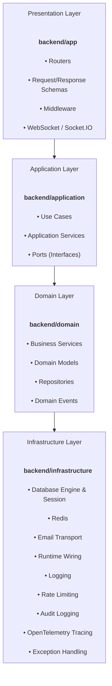
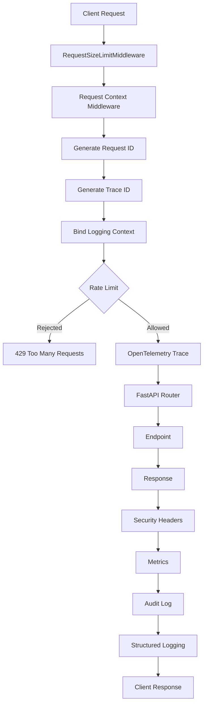
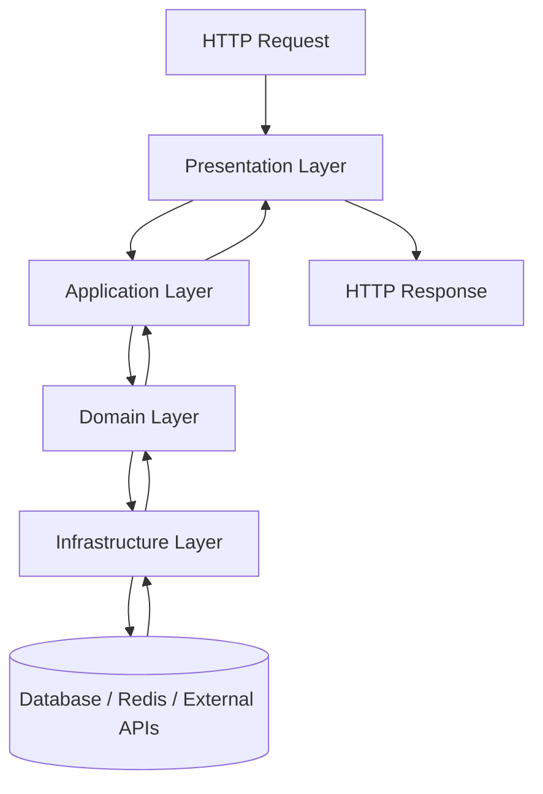

# Tier 4 Architecture — Enterprise FastAPI Boilerplate

A production-oriented FastAPI starter built around a pragmatic, four-layer architecture (presentation → application → domain → infrastructure). It's meant to be easy to read, straightforward to extend, and to save you the first few weeks of scaffolding a "serious" backend service — auth, CRUD, uploads, real-time hooks, middleware, observability, and configuration are all wired up and working.


`tier4-fastapi-boilerplate` · Python 3.10–3.14 · FastAPI · async SQLAlchemy 2.0 · Postgres · Redis · MIT licensed

## Table of Contents

- [Overview](#overview)
- [Why this project](#why-this-project)
- [Architecture](#architecture)
- [Core features](#core-features)
- [Project structure](#project-structure)
- [Quick start](#quick-start)
- [Configuration](#configuration)
- [API reference](#api-reference)
- [Development workflow](#development-workflow)
- [Testing](#testing)
- [Deployment notes](#deployment-notes)
- [Before you ship this: known limitations](#before-you-ship-this-known-limitations)
- [Roadmap](#roadmap)
- [Documentation](#documentation)
- [Contributing](#contributing)
- [License](#license)

## Overview

Tier 4 Architecture is a backend starter focused on clarity and maintainability. It separates concerns into four layers so that business logic, infrastructure concerns, API concerns, and shared utilities remain easy to reason about as the project grows — a change to how you send email shouldn't require touching the router, and a change to a validation rule shouldn't require touching the database layer.

### What you get out of the box

- A fully runnable FastAPI application with health/readiness endpoints and OpenAPI docs (`/docs`, `/redoc`)
- JWT-based authentication with access + refresh tokens, password reset, email verification, and account lockout after repeated failed logins
- Role/permission primitives for admin-style access control
- A sample `products` module demonstrating a second domain with search, sort, and pagination-style listing
- Multipart file upload with authentication, local storage, and static serving
- Middleware for request correlation (request ID / trace ID), rate limiting, and payload-size protection
- Environment-profile configuration with `*_FILE`-based secret resolution for container/secret-mount deployments
- Pluggable email delivery (console backend for local dev, SMTP for real sending)
- An explicit infrastructure-registration layer wiring logging, Redis, background jobs, and email onto `app.state`
- Socket.IO + a bare WebSocket endpoint for real-time experimentation
- Alembic migration scaffolding, a local seed-data script, and an automated test suite covering the flows above
- Docker + Docker Compose (API + Postgres + Redis) and a GitHub Actions CI workflow (lint + test) out of the box

## Why this project

This starter is intentionally practical rather than theoretical — the goal is a structure close to what you'd actually ship, not a textbook diagram:

- Clear separation of concerns across four layers, so features can be added without cross-cutting rewrites
- Fast iteration: the layered pattern in [Development workflow](#development-workflow) is the same for every new feature
- Built-in support for common operational concerns (health checks, rate limiting, request correlation, structured logging)
- Approachable for developers newer to FastAPI or layered architecture — each layer maps to one clear question ("what does this mean for the business," "how do I orchestrate this," "how do I store this," "how do I talk to the outside world")
- A real (if imperfect — see [known limitations](#before-you-ship-this-known-limitations)) test suite around the core flows, so you have a safety net from day one

Whether you're building an internal tool, an early-stage SaaS backend, or a learning project on layered architecture, this gives you a working structure to build on rather than a blank `main.py`.

## Architecture



1. **Presentation layer** — FastAPI routers and handlers, Pydantic request/response validation, WebSocket and Socket.IO endpoints, OpenAPI documentation.
2. **Application layer** — explicit use cases (e.g. `RegisterUserUseCase`, `LoginUseCase`, `CreateProductUseCase`) that orchestrate a business workflow end to end, plus ports that describe outbound integrations without binding the domain to a specific SDK.
3. **Domain layer** — business logic in services, persistence access in repositories, entities as SQLAlchemy models, and `DomainEvent`s for communicating meaningful state changes.
4. **Infrastructure layer** — async SQLAlchemy sessions, the Redis client, email transport, explicit startup/shutdown registration for logging/cache/background jobs, and deployment-oriented configuration.

For the full request-by-request walkthrough of how a call moves through these layers, see [docs/DOCUMENTATION.md](docs/DOCUMENTATION.md#2-request-lifecycle-in-detail).

## HTTP Request Lifecycle

Every incoming HTTP request passes through a series of middleware components before reaching an API endpoint. Each middleware focuses on a single responsibility, keeping the request pipeline modular and easy to extend.



| Stage                      | Responsibility                                                                                   |
| -------------------------- | ------------------------------------------------------------------------------------------------ |
| RequestSizeLimitMiddleware | Protects the application from oversized request bodies by validating the streamed payload size.  |
| Request Context            | Generates a unique Request ID and Trace ID for request correlation.                              |
| Logging Context            | Binds request metadata into ContextVars so every log automatically includes request information. |
| Rate Limiter               | Rejects clients exceeding the configured request limit with HTTP 429.                            |
| OpenTelemetry              | Creates a tracing span around the request lifecycle for observability.                           |
| Router                     | Resolves the incoming route and executes dependencies.                                           |
| Endpoint                   | Runs the application or domain logic.                                                            |
| Security Headers           | Adds common HTTP security headers before sending the response.                                   |
| Metrics                    | Updates in-process request counters exposed through `/metrics`.                                  |
| Audit Logger               | Records security-sensitive operations for auditing.                                              |
| Structured Logger          | Writes request completion logs including request ID, trace ID, status code, and latency.         |

### Design Principles

The middleware pipeline follows a single-responsibility design where each component performs one well-defined task before passing the request to the next stage.

Benefits include:

- Request correlation across distributed services using Request IDs and Trace IDs.
- Centralized security through middleware instead of individual endpoints.
- Automatic structured logging without polluting business logic.
- Early request rejection for oversized payloads and rate-limited clients.
- Consistent observability through tracing, metrics, and audit logging.
- Clean separation between infrastructure concerns and application logic.

## Layer Interaction

Once a request passes through the middleware pipeline, it enters the application's four-layer architecture. Each layer has a single responsibility and communicates only with its adjacent layer, reducing coupling and improving maintainability.



### Layer Responsibilities

| Layer              | Responsibility                                                                                                    |
| ------------------ | ----------------------------------------------------------------------------------------------------------------- |
| **Presentation**   | Receives HTTP requests, performs validation, authentication, middleware execution, and returns HTTP responses.    |
| **Application**    | Coordinates use cases, orchestrates workflows, and manages transactions without containing business rules.        |
| **Domain**         | Implements business logic, validation rules, entities, repositories, and domain services.                         |
| **Infrastructure** | Provides database access, Redis, email services, file storage, tracing, logging, and other external integrations. |

### Design Principles

- Business logic remains independent from HTTP and database implementations.
- Infrastructure concerns are isolated behind abstractions.
- Each layer has a single responsibility.
- Dependencies flow inward toward the domain.
- Features can evolve independently without affecting unrelated layers.

## Core features

### Authentication and session management

- User registration, login, and logout
- Access-token + refresh-token issuance and rotation, with revocation on logout
- Password reset (request/confirm) and email verification (request/confirm) flows
- Account lockout after repeated failed login attempts
- Lightweight, pluggable email notifications for the flows above (console backend by default, SMTP for real environments)

### User and admin workflows

- CRUD endpoints for users, plus a `/me` profile route for the current authenticated user
- Admin-style listing endpoint and a permissions example endpoint demonstrating policy-based access checks
- Role (`role`) and explicit `permissions` list on the user model, evaluated through a small `AuthorizationPolicy`/`PermissionPolicy` layer

### Product module

A second domain module included to show the same layered pattern applied twice:

- Create, read, update, delete
- Search (`search`), pagination-style listing (`skip`/`limit`), and sorting (`sort`/`order`) on the list endpoint
- OpenAPI examples on the request/response schemas

### Files and media

- Multipart upload endpoint (`POST /api/v1/uploads/`)
- Local disk storage by default, served back under `/static/uploads`

### Reliability and observability

- Request ID / trace ID generation and propagation via `x-request-id` / `x-trace-id` headers, bound into the logging context for correlation
- In-memory rate limiting (single-instance; see [known limitations](#before-you-ship-this-known-limitations) for multi-instance caveats)
- Request-size protection for oversized payloads
- `/health` (liveness) and `/health/ready` (DB + Redis ping) endpoints
- `/metrics` (in-process request counters) and `/runtime` (operational snapshot: environment, uptime, metrics) endpoints
- Span-style tracing hooks around HTTP requests, login, product creation, and uploads (structured logging today — see [known limitations](#before-you-ship-this-known-limitations) for the gap between this and a wired-up OpenTelemetry exporter)

### Real-time support

- Socket.IO server mounted at `/socket.io` with `connect`/`disconnect`/`ping` handlers and an example client-triggered event
- A bare WebSocket endpoint at `/ws/health` for connection testing

## Project structure

- [backend/app](backend/app) — API routers, the app factory, bootstrap registration (middleware/routers/static), and Socket.IO wiring
- [backend/application](backend/application) — use cases per feature (`users/`, `products/`, `auth/`), plus shared ports and application-level services
- [backend/domain](backend/domain) — per-feature services, repositories, and models (`users/`, `products/`), plus `events/` for domain events
- [backend/database](backend/database) — async engine/session setup and the shared declarative base
- [backend/common](backend/common) — shared cross-cutting code: schemas, auth dependencies, RBAC/permissions, rate limiting, logging, audit trail, exceptions, tracing, background jobs, base repository/service classes
- [backend/infrastructure](backend/infrastructure) — startup/shutdown wiring that attaches logging, Redis, background jobs, and email onto `app.state`
- [backend/integrations](backend/integrations) — adapters bridging the domain to external systems (currently: email)
- [backend/platform](backend/platform) — the `PlatformRuntime` facade backing `/runtime`
- [backend/contracts](backend/contracts) — API-facing mirror types for a few response shapes
- [backend/utils](backend/utils) — the Redis client and small runtime helpers
- [backend/services](backend/services) — a small runtime-service container (see note below)
- [backend/scripts](backend/scripts) — local dev seed-data script
- [tests](tests) — the automated test suite
- [alembic](alembic) — migration environment and versions
- [deployment](deployment) — per-environment `.env` templates

> **Note:** a few of the packages above (`backend/services`, parts of `backend/contracts`, `backend/common/pagination.py`) overlap in purpose with other packages that are actually wired into the running app. If you're auditing this codebase before extending it, [DOCUMENTATION.md](DOCUMENTATION.md#appendix-a--corrections-from-the-original-documentation) has the details on which implementation is the one actually in use.

## Quick start

### Prerequisites

- Python 3.10–3.14
- A virtual environment tool (venv, conda, etc.)
- Postgres and Redis reachable at the URLs in your `.env` (or use Docker Compose, below, to get both for free)
- Optional: Docker and Docker Compose for containerized development

### 1. Clone the repository

```bash
git clone <your-repo-url>
cd tier4-fastapi-boilerplate
```

### 2. Create and activate a virtual environment

```bash
python -m venv .venv
source .venv/bin/activate
```

On Windows PowerShell:

```powershell
python -m venv .venv
.\.venv\Scripts\Activate.ps1
```

### 3. Install dependencies

```bash
pip install -r requirements.txt
# or, for local development with lint/type-check/test tooling:
pip install -e .[dev]
```

### 4. Configure environment variables

Copy [.env.example](.env.example) to `.env` and adjust the values.

At minimum, review before running anything beyond local dev:

| Variable                                                                    | Why it matters                                                                                                                    |
| --------------------------------------------------------------------------- | --------------------------------------------------------------------------------------------------------------------------------- |
| `DATABASE_URL`                                                              | Points at your Postgres instance.                                                                                                 |
| `REDIS_URL`                                                                 | Points at your Redis instance.                                                                                                    |
| `SECRET_KEY`                                                                | JWT signing key — **must** be changed outside local dev.                                                                          |
| `DEFAULT_ADMIN_EMAIL` / `DEFAULT_ADMIN_USERNAME` / `DEFAULT_ADMIN_PASSWORD` | Used by the seed script to bootstrap an admin — **must** be changed outside local dev.                                            |
| `EMAIL_BACKEND` + `SMTP_*`                                                  | Switch from console-only email to real SMTP delivery.                                                                             |
| `CORS_ORIGINS`                                                              | Restrict to your real frontend origin(s) in any shared environment.                                                               |
| `ENABLE_TRACING` / `OTEL_MODE` / `OTEL_EXPORTER_OTLP_ENDPOINT`              | Tracing configuration — see [known limitations](#before-you-ship-this-known-limitations) for what this does and doesn't do today. |

### 5. Run database migrations (optional for local dev, required beyond it)

```bash
alembic upgrade head
```

The app's startup lifecycle will also call `create_all` for convenience in local dev, but that's not a substitute for migrations anywhere the schema needs to evolve safely.

### 6. (Optional) Seed local data

```bash
python -m backend.scripts.seed_data
```

Creates a default admin account and two example products if they don't already exist. **Local development only** — see [known limitations](#before-you-ship-this-known-limitations).

### 7. Run the application

```bash
uvicorn backend.main:app --reload
```

The API docs will be available at:

- http://127.0.0.1:8000/docs
- http://127.0.0.1:8000/redoc

### 8. Optional: run with Docker

```bash
docker compose up --build
```

This brings up the API alongside `postgres:16-alpine` and `redis:7-alpine`, so you don't need either installed locally to try the project.

## Configuration

The application uses environment-based configuration (`pydantic-settings`) with support for profile-specific files and secret-file resolution, so credentials don't need to live in the source tree.

Load order (highest precedence last): `ENV_FILE` (if set) → `.env` → `.env.<environment>` → `.env.<environment>.local` → `.env.local` → real process environment variables → field defaults.

Settings roughly group into:

- **Project metadata** — name, API version prefix (`API_V1_STR`)
- **Database & cache** — `DATABASE_URL`(`_FILE`), `REDIS_URL`(`_FILE`)
- **Auth** — `SECRET_KEY`(`_FILE`), `ALGORITHM`, `ACCESS_TOKEN_EXPIRE_MINUTES`, `PASSWORD_RESET_TOKEN_TTL_MINUTES`
- **CORS** — `CORS_ORIGINS`
- **Rate limiting & payload protection** — `ENABLE_RATE_LIMITING`, `RATE_LIMIT_REQUESTS_PER_MINUTE`, `MAX_REQUEST_SIZE_BYTES`
- **Uploads** — `UPLOAD_DIR`
- **Email** — `EMAIL_BACKEND` (`console`/`smtp`), `SMTP_HOST`/`SMTP_PORT`/`SMTP_USERNAME`/`SMTP_PASSWORD`/`SMTP_USE_TLS`/`SMTP_USE_SSL`/`SMTP_FROM_EMAIL`
- **Seed admin** — `DEFAULT_ADMIN_EMAIL`/`DEFAULT_ADMIN_USERNAME`/`DEFAULT_ADMIN_PASSWORD`
- **Transport security** — `REQUIRE_HTTPS`
- **Tracing** — `ENABLE_TRACING`, `OTEL_MODE`, `OTEL_EXPORTER_OTLP_ENDPOINT`, `OTEL_SERVICE_NAME`

The full field-by-field reference (defaults and purpose for every setting) is in [DOCUMENTATION.md](DOCUMENTATION.md#5-configuration--environment-variables-reference).

If you're deploying anywhere shared, provide secrets via real environment variables or the `*_FILE` settings (pointing at a mounted secret file) — never commit real credentials to a `.env`.

## API reference

All routes below live under `API_V1_STR` (default `/api/v1`) unless noted otherwise. See [DOCUMENTATION.md](DOCUMENTATION.md#4-full-api-endpoint-reference) for the complete table including which routes currently require authentication.

| Method                    | Path                                                    | Purpose                                                                                                                  |
| ------------------------- | ------------------------------------------------------- | ------------------------------------------------------------------------------------------------------------------------ |
| POST                      | `/api/v1/users/`                                        | Register a user                                                                                                          |
| GET                       | `/api/v1/users/me`                                      | Current user's profile                                                                                                   |
| GET / PUT / DELETE        | `/api/v1/users/{user_id}`                               | Read / update / delete a user                                                                                            |
| GET                       | `/api/v1/users/`                                        | List users                                                                                                               |
| POST                      | `/api/v1/auth/login`                                    | Authenticate, receive access + refresh tokens                                                                            |
| POST                      | `/api/v1/auth/refresh`                                  | Rotate a refresh token                                                                                                   |
| POST                      | `/api/v1/auth/logout`                                   | Revoke a refresh token                                                                                                   |
| POST                      | `/api/v1/auth/password-reset/request` \| `/confirm`     | Password reset flow                                                                                                      |
| POST                      | `/api/v1/auth/email-verification/request` \| `/confirm` | Email verification flow                                                                                                  |
| POST / GET / PUT / DELETE | `/api/v1/products/` \| `/{product_id}`                  | Product CRUD; writes require auth, list/read remain public, and list supports `search`, `skip`, `limit`, `sort`, `order` |
| POST                      | `/api/v1/uploads/`                                      | Upload a file (auth required)                                                                                            |
| GET                       | `/api/v1/admin/users`                                   | Admin-only user listing                                                                                                  |
| GET                       | `/api/v1/admin/permissions`                             | Permission-policy example endpoint                                                                                       |
| GET                       | `/health`                                               | Liveness check                                                                                                           |
| GET                       | `/health/ready`                                         | Readiness check (DB + Redis)                                                                                             |
| GET                       | `/metrics`                                              | In-process request metrics snapshot                                                                                      |
| GET                       | `/runtime`                                              | Operational snapshot (env, uptime, metrics)                                                                              |
| WS                        | `/ws/health`                                            | Bare WebSocket connectivity check                                                                                        |
| Socket.IO                 | `/socket.io`                                            | Real-time event channel                                                                                                  |

### Example request

```bash
curl -X POST "http://127.0.0.1:8000/api/v1/auth/login" \
  -H "Content-Type: application/x-www-form-urlencoded" \
  -d "username=demo@example.com&password=StrongPass123!"
```

```bash
curl "http://127.0.0.1:8000/api/v1/products/?search=widget&sort=price&order=asc&limit=10"
```

## Development workflow

1. Keep routers thin — parse the request, call a use case, translate the result/errors into a response.
2. Put business rules into domain services, not route handlers.
3. Keep repositories focused on persistence and query logic only.
4. Reuse the shared abstractions in [backend/common](backend/common) (auth dependencies, exceptions, schemas) rather than re-implementing them per feature.
5. Prefer explicit, validated Pydantic schemas over ad-hoc dictionaries — and be deliberate about which fields a schema exposes to which caller (see the registration note in [known limitations](#before-you-ship-this-known-limitations)).
6. Register new startup/shutdown infrastructure concerns through [backend/infrastructure/runtime.py](backend/infrastructure/runtime.py) rather than scattering wiring through the app.
7. Add a regression test whenever behavior changes — both a use-case/service-level test and a route-level test through `TestClient`.

### Adding a new feature module

1. Domain model in [backend/domain/\<feature\>/model.py](backend/domain)
2. Repository for persistence in `backend/domain/<feature>/repository.py`
3. Domain service for business rules in `backend/domain/<feature>/service.py`
4. Application use case(s) in `backend/application/<feature>/use_cases.py` to orchestrate the workflow
5. Request/response schemas in [backend/common/schema.py](backend/common/schema.py)
6. API routes under [backend/app/api/v1/\<feature\>/](backend/app/api/v1)
7. Register the router in [backend/app/api/v1/router.py](backend/app/api/v1/router.py)
8. Any supporting infrastructure (storage, cache, background jobs, an outbound adapter under `backend/integrations/`)

The full walkthrough with the reasoning behind each step is in [DOCUMENTATION.md](DOCUMENTATION.md#6-how-to-implement-a-new-feature-step-by-step).

## Testing

Run the full suite with:

```bash
pytest -q
```

Or, matching CI exactly:

```bash
ruff check backend tests
python -m pytest -q
```

- The suite covers authentication/authorization flows, user and product CRUD (including negative/duplicate/validation cases), health and readiness endpoints, upload handling, WebSocket/Socket.IO interaction, trace-header propagation, middleware branches for rate limiting and request-size protection, and seed-data initialization. See [DOCUMENTATION.md](DOCUMENTATION.md#9-testing-strategy) for a file-by-file breakdown of what each test module actually checks.

## Deployment notes

The project ships with a working `Dockerfile` (non-root user, healthcheck against `/health`) and `docker-compose.yml` (API + Postgres + Redis), plus a GitHub Actions workflow that lints and tests every push/PR to `main`/`master`.

Before deploying beyond local development:

- Use a real, non-default database and Redis instance — not the compose file's `postgres`/`postgres` local credentials.
- Provide all credentials via environment variables or mounted secret files (the `*_FILE` settings exist for exactly this).
- Change `SECRET_KEY` and `DEFAULT_ADMIN_PASSWORD` away from their defaults — nothing currently stops the app from booting with the defaults in place, so this is on you to enforce.
- Put a TLS-terminating reverse proxy in front, and set `REQUIRE_HTTPS=true`.
- Read [known limitations](#before-you-ship-this-known-limitations) below and address the ones relevant to your deployment (especially the endpoint-auth and rate-limiter/audit-log scalability notes) — they're not edge cases, they're gaps in the current baseline.
- Wire `/health/ready` and `/runtime` into your orchestrator's readiness probes and dashboards.

## Before you ship this: known limitations

This is a boilerplate, and boilerplates get copied into real projects wholesale more often than they get read line-by-line first. So, as plainly as the features are listed above, here's what's currently incomplete or worth a deliberate decision before you rely on it:

- **The public surface is now intentionally narrow** — public registration and the public product catalog remain available, while product write operations and uploads now require authentication. Review any endpoint-specific access rules before exposing them beyond the current baseline.
- **Public registration and role assignment need to be kept separate** — a self-registration endpoint should never let the caller choose their own role/permissions.
- **Uploaded filenames need sanitizing** before being trusted for on-disk paths.
- **Rate limiting and the audit log are in-process/in-memory** — fine for a single instance, not a real multi-worker/multi-replica guarantee. Back them with Redis/the database respectively if you scale horizontally.
- **Tracing and metrics are lightweight by design** — the tracing hooks produce structured logs today, not a wired-up OpenTelemetry exporter pipeline, and `/metrics`/`/runtime` are process-local snapshots, not a Prometheus-scrape endpoint or cross-instance aggregate.
- **A handful of packages overlap in purpose** (see the note in [Project structure](#project-structure)) — when in doubt about which implementation is "the real one," `backend/infrastructure/runtime.py` is the source of truth for what's attached to `app.state`.

The full, detailed version of this list — with file/line references and suggested fixes — is in [DOCUMENTATION.md §11](DOCUMENTATION.md#11-known-limitations--security-notes-read-before-deploying).

## Roadmap

- Close the gaps above: endpoint auth, registration field-scoping, upload filename sanitization
- Wire up a real OpenTelemetry SDK + OTLP exporter for auth, database, Redis, and Socket.IO boundaries
- Move rate limiting onto Redis and the audit log onto persistent storage, so both hold up under horizontal scaling and restarts
- Add cloud object-storage integration (S3/Azure Blob) for production file handling
- Add contract tests for API schemas and backward compatibility
- Add a second, richer domain module (orders, invoices, or subscriptions) as a guided example of the full layered pattern
- Introduce an outbox pattern and event publisher so `DomainEvent`s are actually propagated somewhere, not just logged
- Formalize environment promotion (dev → staging → prod) for container-based deployment

## Documentation

For the full architecture walkthrough, request-lifecycle trace, complete endpoint/config reference, and the detailed known-limitations writeup, see [DOCUMENTATION.md](docs/DOCUMENTATION.md).

## Contributing

Issues and pull requests are welcome. Before opening a PR:

1. Run `ruff check backend tests` and `pytest -q` locally.
2. Add or update tests for any behavior change — prefer a real assertion over an "it imports" smoke test.
3. If you're fixing something listed under [known limitations](#before-you-ship-this-known-limitations), please also add the regression test that would have caught it.

## License

MIT — see [LICENSE](LICENSE).
