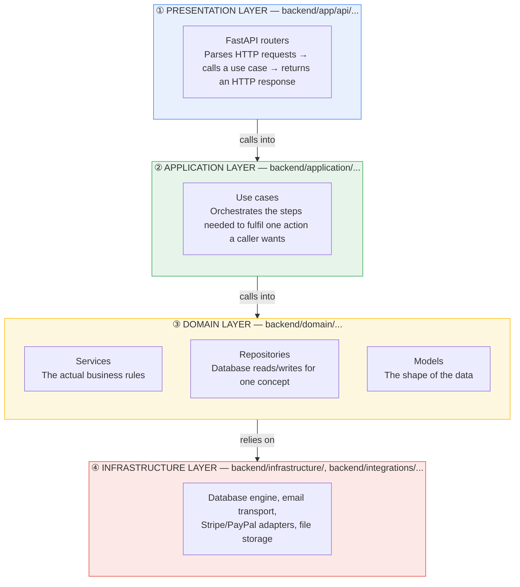
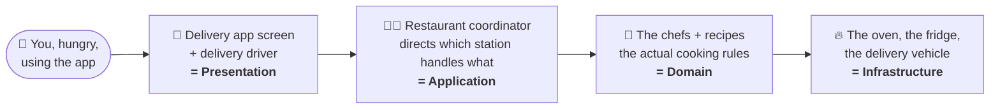
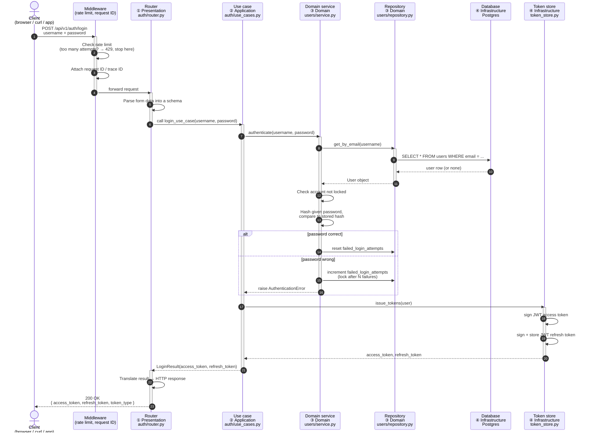
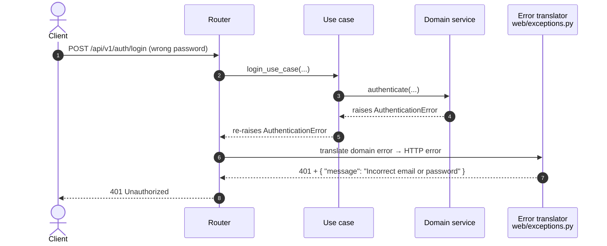
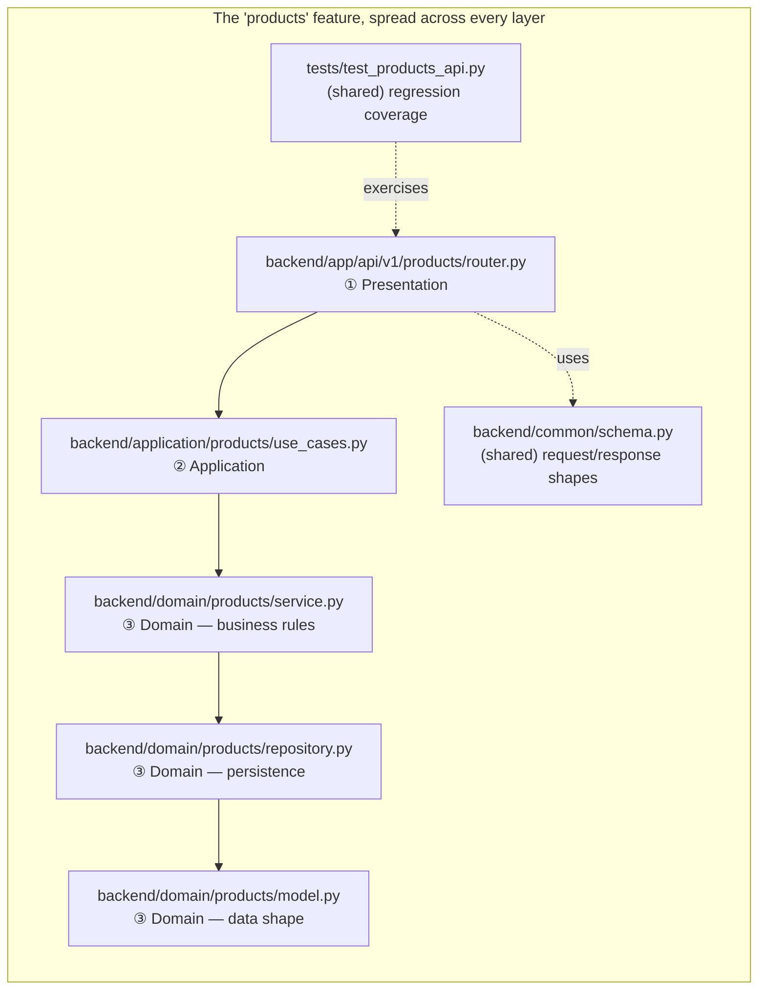
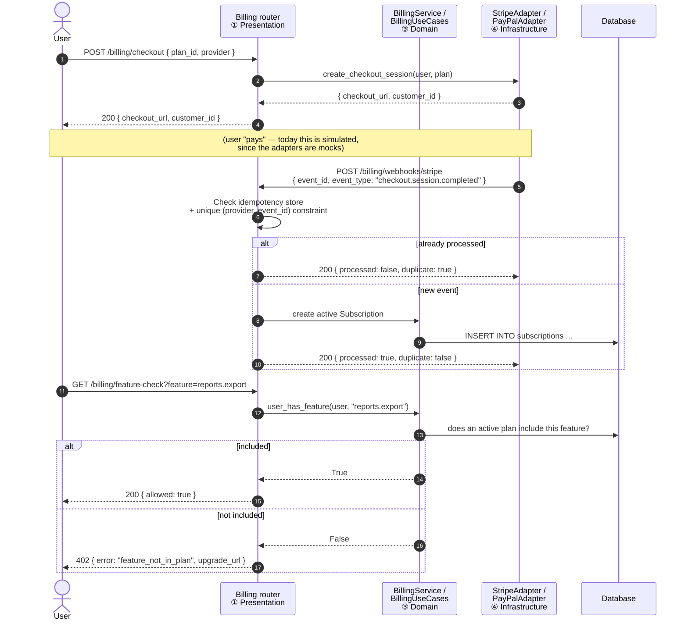
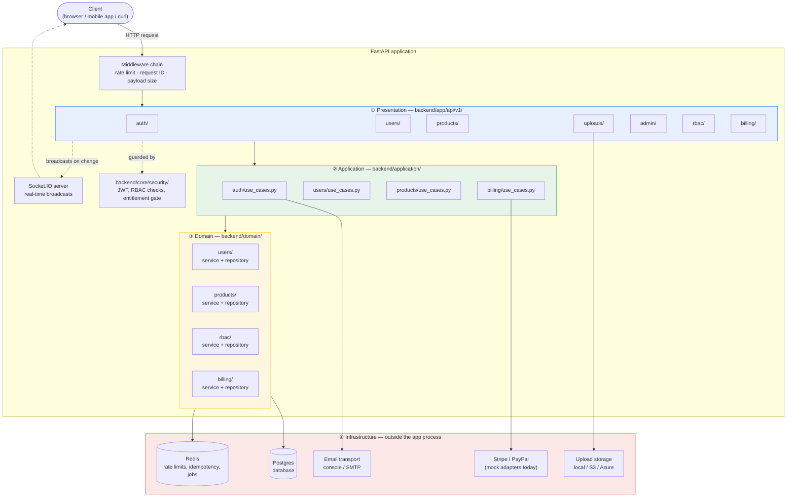
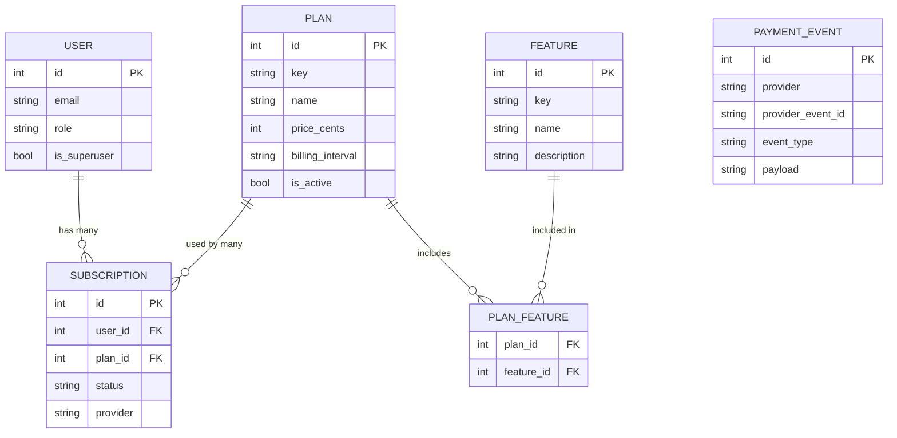
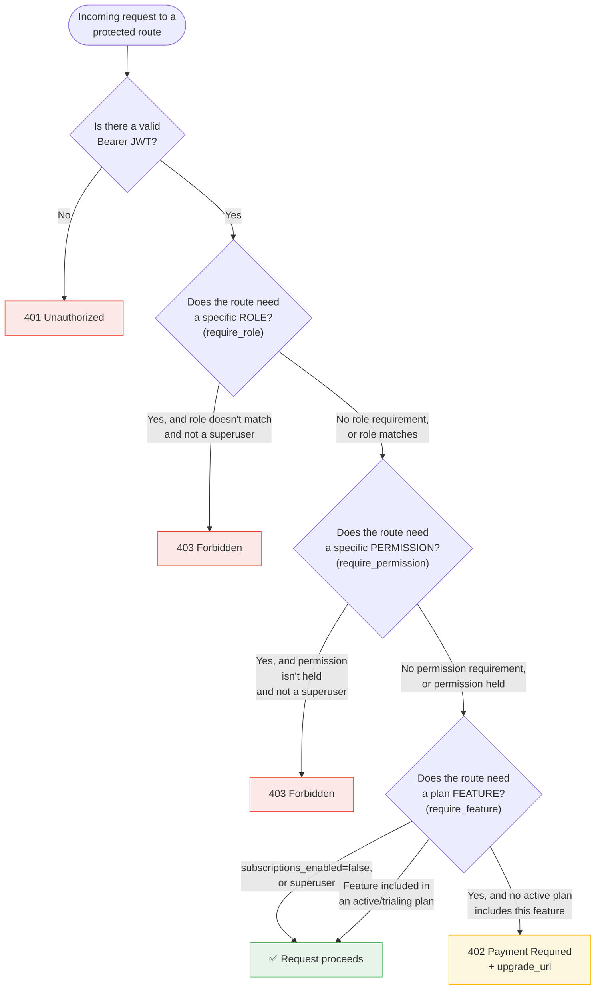

# Learning Guide — Tier 4 Architecture, Explained for Beginners

> **Goal of this document:** get you from "I've never seen this codebase" to "I understand how it works and could confidently add a new feature" — with zero assumed prior knowledge of FastAPI, layered architecture, or this specific project.
>
> This is a _companion_ to [README.md](README.md) and [docs/DOCUMENTATION.md](docs/DOCUMENTATION.md), which are the technical reference. This file is the **teaching** version — it explains the _why_ before the _what_, uses analogies and diagrams, and gives you a day-by-day path to follow.
>
> This edition is the **expanded** version: deeper explanations, more diagrams (rendered in [Mermaid](https://mermaid.js.org/), viewable on GitHub or any Mermaid-aware Markdown viewer), a longer learning path, a full glossary, and more hands-on exercises than the original.

---

## Table of contents

1. [What is this project, in plain English?](#1-what-is-this-project-in-plain-english)
2. [Jargon buster — words you'll see everywhere](#2-jargon-buster--words-youll-see-everywhere)
3. [The big idea: four layers](#3-the-big-idea-four-layers)
4. [Following one request, step by step](#4-following-one-request-step-by-step)
5. [The folder map (what lives where, and why)](#5-the-folder-map-what-lives-where-and-why)
6. [The features this app already has](#6-the-features-this-app-already-has)
7. [How the pieces connect: a full system map](#7-how-the-pieces-connect-a-full-system-map)
8. [The database, visually](#8-the-database-visually)
9. [Security and permissions, visually](#9-security-and-permissions-visually)
10. [Your learning path (day by day)](#10-your-learning-path-day-by-day)
11. [Hands-on exercises](#11-hands-on-exercises)
12. [Reading order — the files that matter most](#12-reading-order--the-files-that-matter-most)
13. [Anatomy of a feature: build one yourself, annotated](#13-anatomy-of-a-feature-build-one-yourself-annotated)
14. [Common beginner questions](#14-common-beginner-questions)
15. [Mistakes beginners make (and how to avoid them)](#15-mistakes-beginners-make-and-how-to-avoid-them)
16. [Mental models to keep in your head](#16-mental-models-to-keep-in-your-head)
17. [Full glossary (A–Z)](#17-full-glossary-az)
18. [Where to go next](#18-where-to-go-next)

---

## 1. What is this project, in plain English?

Imagine you're opening a restaurant. You could just start cooking in a random kitchen with no layout — pots everywhere, ingredients mixed with cleaning supplies, no clear station for prep vs. cooking vs. plating. It would _work_, technically, but it would fall apart the moment you got more than one order at a time.

**Tier 4 Architecture is a pre-built "restaurant kitchen"** for backend web applications. It's not a finished restaurant (it doesn't have your specific menu/business logic yet) — it's the professionally laid-out kitchen: prep stations, cooking stations, a pass, a walk-in fridge, all already plumbed and wired, so that when you _do_ add your menu, everything has an obvious place to go.

In concrete terms:

- It's a **backend** — the part of an app that runs on a server, stores data, and answers requests from a phone app, a website, or another program. It has no visual interface of its own; it speaks JSON over HTTP.
- It's built with **FastAPI** — a Python framework for building these backends quickly, with automatic request validation and self-documenting endpoints.
- It already includes the boring-but-essential stuff every real app needs: user accounts and login, permissions, file uploads, health checks, error handling, rate limiting, and (as of the latest update) **subscription billing** — so you don't have to build those from scratch.
- It's organized using a **layered architecture** (explained in §3), which is a specific, disciplined way of organizing code so a project with 50 features stays as easy to navigate as a project with 2.

### Why does this kind of "starter kit" exist at all?

Almost every real product — a SaaS tool, a mobile app's backend, an internal company dashboard — needs the _same_ unglamorous foundation before it can do anything unique:

- Some way for people to create an account and log in
- Some way to decide who's allowed to do what
- Somewhere to store and retrieve data safely
- Some way to upload and serve files
- Some way to know if the server is healthy
- Increasingly, some way to charge money and gate features by subscription plan

None of that is _your_ product's actual value — it's the plumbing underneath it. Building it well (securely, testably, in a way that survives growth) takes real experience and real time. This project gives you a version of that plumbing that's already been built, tested, and — as of the most recent documentation pass — audited for gaps between what the docs claimed and what the code actually does.

### Who is this for?

Anyone starting a new backend project who wants a solid, tested starting point instead of a blank file — whether you're a solo developer, a student learning "how do real backends get organized," or a team standardizing on a shared pattern before splitting into feature teams.

---

## 2. Jargon buster — words you'll see everywhere

Skim this once, then come back to it whenever a term trips you up. A much longer, alphabetized version lives in [§17](#17-full-glossary-az) for later reference.

| Term                                      | Plain-English meaning                                                                                                                                                                                                                                                                                      |
| ----------------------------------------- | ---------------------------------------------------------------------------------------------------------------------------------------------------------------------------------------------------------------------------------------------------------------------------------------------------------- |
| **API**                                   | A menu of things a program can ask a server to do (e.g., "create a user," "list products"), and the rules for asking.                                                                                                                                                                                      |
| **REST API**                              | An API where you ask for things using URLs and HTTP verbs (`GET` = read, `POST` = create, `PUT` = update, `DELETE` = delete).                                                                                                                                                                              |
| **Endpoint / route**                      | One specific "menu item" — e.g. `POST /api/v1/users/` is the endpoint for "create a user."                                                                                                                                                                                                                 |
| **JSON**                                  | A simple text format for structured data, like `{"name": "Alice", "age": 30}`. Almost everything this API sends and receives is JSON.                                                                                                                                                                      |
| **HTTP status code**                      | A 3-digit number telling you what happened: `200` = OK, `201` = created, `400` = you sent something wrong, `401` = you're not logged in, `403` = you're logged in but not allowed, `404` = doesn't exist, `422` = your data didn't pass validation, `429` = you're rate-limited, `500` = the server broke. |
| **Database / Postgres**                   | Where data is permanently stored (users, products, subscriptions...). Postgres is the specific database engine this project uses.                                                                                                                                                                          |
| **ORM (SQLAlchemy)**                      | A tool that lets you work with database rows as if they were normal Python objects, instead of writing raw SQL by hand.                                                                                                                                                                                    |
| **Migration (Alembic)**                   | A recorded, version-controlled change to the database's structure (e.g. "add a `phone_number` column to `users`"). Lets a team evolve the database safely over time.                                                                                                                                       |
| **Async / `await`**                       | A way for Python to handle many requests at once without waiting idly on slow things (like a database query) one at a time. You'll see `async def` and `await` throughout — for now, just know it means "this function might pause here to wait on something, and that's fine."                            |
| **JWT (JSON Web Token)**                  | A signed, tamper-proof string that proves "this request is from a logged-in user" without the server needing to look up a session on every request. This app gives you one when you log in.                                                                                                                |
| **Bearer token**                          | The way you _use_ a JWT — you put it in a request header: `Authorization: Bearer <the token>`.                                                                                                                                                                                                             |
| **Dependency injection (`Depends(...)`)** | FastAPI's way of saying "before running this endpoint, first run this other function and hand me its result." Used constantly for things like "get the current logged-in user" or "get a database connection."                                                                                             |
| **Pydantic model / schema**               | A Python class that describes the _shape_ of expected data (e.g. "a user must have an email string and a password string") and automatically validates/rejects bad input.                                                                                                                                  |
| **RBAC**                                  | Role-Based Access Control — deciding who can do what based on a `role` (like `admin`) or specific granted `permissions` (like `billing.manage`).                                                                                                                                                           |
| **Middleware**                            | Code that runs on _every_ request, before/after your endpoint — used here for things like rate limiting and adding a request ID.                                                                                                                                                                           |
| **Webhook**                               | A way for an _external_ service (like Stripe) to notify _this_ app when something happens ("payment succeeded") by sending it an HTTP request.                                                                                                                                                             |
| **Idempotent**                            | Doing something twice has the same effect as doing it once. Important for webhooks, since the same notification can arrive more than once.                                                                                                                                                                 |
| **Repository (pattern)**                  | A class whose only job is talking to the database for one type of thing (e.g. `UserRepository` only knows how to read/write users).                                                                                                                                                                        |
| **Service (domain service)**              | A class holding the _business rules_ for one concept — e.g. "a password must be hashed before saving," "an account locks after 5 failed logins."                                                                                                                                                           |
| **Use case**                              | A class that _orchestrates_ a specific action a user of the API wants to do, calling into one or more services to make it happen.                                                                                                                                                                          |
| **Adapter**                               | A small class whose only job is translating between "what our domain needs" and "what one specific external system's API looks like" (e.g. `StripeAdapter`).                                                                                                                                               |
| **Port**                                  | The _interface_ (contract) an adapter must fulfil — defined in our own code, independent of any specific vendor.                                                                                                                                                                                           |

---

## 3. The big idea: four layers

This is the single most important concept in the whole codebase. Once it clicks, everything else makes sense — so this section is deliberately the longest and most repetitive one in the guide. Read it slowly.

### 3.1 The stack, visually



**The one rule that matters most:** arrows only point _downward_. Presentation knows about Application. Application knows about Domain. Domain knows about Infrastructure _only through an interface it defines itself_ (a "port"), never the other way around. A domain service is never allowed to import a FastAPI router. This one-directional rule is what keeps the whole thing untangled as it grows.

### 3.2 Why bother splitting it up like this?

A few reasons that matter a lot once a project grows past a "weekend project" size:

1. **You always know where to look.** Bug in how an HTTP error is formatted? Layer 1. Bug in "should this user be allowed to do this"? Layer 3. Need to switch from SMTP email to a different provider? Layer 4 only — nothing else changes.
2. **You can test business rules without a real database or a real HTTP server.** Because the domain layer doesn't know or care _how_ it's called, you can test "does the password-strength rule work?" in milliseconds, with no network calls at all.
3. **Swapping technology doesn't ripple through the whole app.** Want to swap Stripe for a different payment processor? You rewrite one adapter in layer 4. The domain rules about plans/subscriptions don't change at all — this is exactly the situation the billing module is in today (see §6).
4. **New developers can be productive fast.** Because every feature follows the _identical_ shape, once you deeply understand one feature (like Products), you already know 80% of how every other feature works before you've read a line of it.
5. **It documents intent, not just mechanics.** A file living in `domain/` is a strong signal "this is a business rule, treat it as important and test it well." A file in `infrastructure/` signals "this is a technical detail, it's fine to swap it out."

### 3.3 An analogy: ordering food delivery



- **Presentation layer** = the delivery app's screen and the delivery driver. It takes your order (HTTP request) and hands you your food (HTTP response). It doesn't cook.
- **Application layer** = the person at the restaurant coordinating "okay, this order needs the grill station, then the salad station, then boxing." It doesn't cook either — it directs.
- **Domain layer** = the actual chefs and recipes — the _rules_ ("a medium steak is cooked to this temperature," "this dish can't be made if we're out of an ingredient").
- **Infrastructure layer** = the oven, the fridge, the delivery vehicle itself — the real-world tools everything else depends on but doesn't need to think about the mechanics of.

### 3.4 How this maps to actual folders

| Layer            | Folder                                                   | Example file                               | Analogy role               |
| ---------------- | -------------------------------------------------------- | ------------------------------------------ | -------------------------- |
| ① Presentation   | `backend/app/api/v1/<feature>/router.py`                 | `backend/app/api/v1/billing/router.py`     | The delivery app screen    |
| ② Application    | `backend/application/<feature>/use_cases.py`             | `backend/application/billing/use_cases.py` | The restaurant coordinator |
| ③ Domain         | `backend/domain/<feature>/{model,service,repository}.py` | `backend/domain/billing/service.py`        | The chef + recipe book     |
| ④ Infrastructure | `backend/infrastructure/`, `backend/integrations/`       | `backend/integrations/stripe_adapter.py`   | The oven, the delivery van |

### 3.5 What each layer is _not_ allowed to do

This "negative space" is just as important as what each layer _does_ do:

- **Presentation must not contain business rules.** If you see an `if` statement in a router checking something like "is this password strong enough," that logic is in the wrong place — it belongs in a domain service.
- **Application must not talk to the database directly.** It calls a domain service or repository to do that; it just sequences the calls.
- **Domain must not know about HTTP.** A domain service has no idea what a "request" or a "response" or a "status code" is — it only knows about business concepts (users, plans, orders).
- **Domain must not import a specific vendor SDK directly.** If the domain needs to send an email or call Stripe, it depends on a small `Protocol`/port it defines itself (see `backend/application/ports.py`), and the _actual_ Stripe/SMTP code lives in `infrastructure`/`integrations`, implementing that port.

Every single feature in this app (`users`, `products`, `auth`, `uploads`, `billing`, `rbac`) follows this exact same shape. **Learn the shape once by studying one feature deeply, and you can navigate every other feature for free.**

---

## 4. Following one request, step by step

Let's trace a real example end to end: **a user logging in.** This is the same journey described in §3, but now with concrete inputs and outputs at each stage.

### 4.1 The request lifecycle, as a sequence diagram



### 4.2 The same flow, narrated in plain English

1. **Middleware runs first, on _every_ request** — before your endpoint code ever executes. It checks: is this client sending too many requests too fast (rate limiting)? Is the payload too big? It also stamps a request ID onto the request so every log line about this one request can be tied together later.
2. **The presentation layer (the router)** receives the parsed request. Its _only_ job is: understand what was asked, hand it to the application layer, and translate whatever comes back into a proper HTTP response. It contains almost no logic of its own.
3. **The application layer (the use case)** is the orchestrator. For login specifically, it says (in effect) "authenticate this user, and if that succeeds, issue them tokens" — two separate concerns (identity verification, and token issuance) coordinated in the right order.
4. **The domain layer** does the actual thinking. The **service** enforces the rules ("is the account locked?" "does the password match?"), and the **repository** is the only thing allowed to read/write the `User` row in the database on the service's behalf.
5. **The infrastructure layer** does the low-level, technical work: actually running the SQL query against Postgres, and actually signing a JWT with a cryptographic secret.
6. **The response flows back up** through the exact same layers, in reverse, until the router turns it into JSON and an HTTP status code the client understands.

### 4.3 What happens on a _failed_ login (a second, shorter trace)



Notice this app deliberately returns the **same** `401` message whether the _email_ doesn't exist or the _password_ is wrong — that's an intentional security choice (it doesn't let an attacker learn "this email is/isn't registered" by watching for different error messages), enforced at the domain layer and simply passed through by everything above it.

### 4.4 The habit to build

Whenever you're confused about "where does X happen," ask yourself:

> _"Is this about talking to the outside world (①), coordinating steps (②), a business rule (③), or a technical detail like a database/email/payment call (④)?"_

That question — asked consistently — tells you which folder to open, every single time, for every feature in this codebase.

---

## 5. The folder map (what lives where, and why)

Open the project and keep this table next to you the first few times you explore.

```
backend/
├── app/                    # Presentation layer — FastAPI wiring
│   ├── api/v1/              #   one subfolder per feature: auth/, users/, products/,
│   │                         #   uploads/, admin/, rbac/, billing/ — each has a router.py
│   ├── bootstrap/            #   code that registers middleware/routers/static files at startup
│   ├── factory.py            #   builds the actual FastAPI() app object
│   ├── lifespan.py           #   "what happens on startup/shutdown"
│   └── socketio_app.py       #   real-time (WebSocket) event handlers
│
├── application/             # Application layer — use cases (orchestration)
│   ├── users/, products/, auth/, billing/
│   └── ports.py              #   "contracts" describing what an external integration must offer
│
├── domain/                  # Domain layer — the actual business logic
│   ├── users/, products/, billing/, rbac/
│   │     ├── model.py         #   the data shape (a SQLAlchemy table definition)
│   │     ├── service.py       #   the business rules
│   │     └── repository.py    #   database read/write for this one concept
│   └── events/                #   definitions for internal "something happened" events
│
├── database/                # Low-level DB engine/session setup (used by every repository)
├── common/                  # Shared code used across features: schemas, base classes,
│                             #   background jobs
├── core/security/           # Auth: login/JWT dependencies, RBAC role/permission checks,
│                             #   token issuance, the billing "entitlement" gate
├── infrastructure/          # Startup wiring: attaches logging/Redis/email/jobs to the app
├── integrations/            # Adapters to *external* systems: email, Stripe, PayPal
├── resilience/               # Rate limiting, retry logic, webhook idempotency
├── observability/            # Structured logging, audit trail, metrics, tracing
├── contracts/                 # Typed request/response schemas exposed to the API
├── web/                      # Shared HTTP error translation
├── utils/                    # Small helpers (e.g. the Redis client)
└── scripts/                  # One-off scripts, like seeding demo data

tests/                       # Automated tests — one file roughly per feature
alembic/                     # Database migration history
docs/DOCUMENTATION.md        # The deep technical reference
README.md                    # The quick-start + feature overview
```

**A useful trick:** pick any _one_ feature name (e.g. `products`) and search the whole codebase for that word. You'll find its router, its use case, its service, its model, its repository, and its test — five or six files, each doing one clearly-scoped job. That's the whole pattern.

### 5.1 One feature, all its files, in one picture



---

## 6. The features this app already has

Think of these as the "menu" already cooked for you. You'll extend this menu, not rebuild the kitchen.

| Feature                     | What it does                                                                                                                               | Where to start reading                                                                     |
| --------------------------- | ------------------------------------------------------------------------------------------------------------------------------------------ | ------------------------------------------------------------------------------------------ |
| **Auth**                    | Register, login, logout, refresh tokens, password reset, email verification, account lockout after repeated failed logins                  | `backend/app/api/v1/auth/router.py`                                                        |
| **Users**                   | CRUD for user accounts, a `/me` profile route, admin user listing                                                                          | `backend/app/api/v1/users/router.py`                                                       |
| **RBAC**                    | Roles (`user`/`staff`/`admin`) and fine-grained named permissions (like `billing.manage`) that can be checked independently of role        | `backend/core/security/rbac.py`, `backend/app/api/v1/rbac/router.py`                       |
| **Products**                | A second, simpler example domain (CRUD + search/sort/pagination) — a template you can copy for your _own_ first feature                    | `backend/app/api/v1/products/router.py`                                                    |
| **Uploads**                 | Authenticated file uploads with type/size validation, local or cloud (S3/Azure) storage                                                    | `backend/app/api/v1/uploads/router.py`                                                     |
| **Billing & subscriptions** | Plans, features, per-user subscriptions, a "does this user's plan include this feature" gate, Stripe/PayPal checkout, and webhook handling | `backend/app/api/v1/billing/router.py` — see `docs/DOCUMENTATION.md` §14 for the deep dive |
| **Real-time**               | Socket.IO events (e.g. "a product was just created") and a bare WebSocket health check                                                     | `backend/app/socketio_app.py`                                                              |
| **Observability**           | Health/readiness checks, request metrics, structured logging, an audit trail of sensitive actions                                          | `backend/observability/`                                                                   |
| **Resilience**              | Rate limiting, retries with a circuit breaker, idempotent webhook processing                                                               | `backend/resilience/`                                                                      |

**Why billing is worth extra attention:** it's the most recently added, most fully-fleshed-out example of _every layer working together at once_ — a good "advanced" feature to study once the basics click, because it touches models, services, use cases, a router, an external integration (Stripe/PayPal), RBAC permission checks, _and_ a reusable dependency (`require_feature`) other future features can plug into.

### 6.1 The billing checkout + webhook flow, visually

Because billing is the most instructive "advanced" feature, here's its own sequence diagram — notice it's the _same shape_ as the login diagram in §4, just with different names.



---

## 7. How the pieces connect: a full system map

Zooming all the way out — here's every major moving part in the app and how they relate. You don't need to memorize this; use it as a map to return to once individual pieces start feeling familiar.



**How to read this diagram:** solid arrows are "calls into and expects an answer back." Dashed arrows are "guards / reacts to, but isn't the main flow." The whole point of §3's layering rules is visible here: every router talks to a use case, every use case talks to the domain, and _only_ the domain layer talks to the real infrastructure (database, Redis, email, payment providers, storage) — nothing skips a layer.

---

## 8. The database, visually

Beginners often find it easier to understand a feature once they've seen its _data_ shape, not just its code. Here's the billing module's tables as an entity-relationship diagram — a good example because it has several tables that relate to each other in different ways (one-to-many, many-to-many).



**Reading this diagram in plain English:**

- A `User` can have many `Subscription` rows over time (one per plan change, cancellation, renewal, etc.) — `||--o{` means "exactly one, to zero-or-many."
- A `Plan` can have many `Subscription`s (many users can be on the "Pro" plan at once).
- `Plan` and `Feature` relate **many-to-many** through the `PlanFeature` join table — a plan can include many features, and a feature can belong to many plans. This is exactly why `PlanFeature` exists as its own table instead of a simple column: relationships that go "many on both sides" always need a join table like this.
- `PaymentEvent` isn't connected to the others by a foreign key at all — it's a standalone audit record of every webhook received, used purely to prevent double-processing (see §6.1 and `docs/DOCUMENTATION.md` §14.3).

---

## 9. Security and permissions, visually

This app checks "is this allowed?" in three different, composable ways. Seeing them as one decision tree makes the difference click much faster than reading prose alone.



**The key insight:** these three checks are independent and can be mixed freely. A route might need _only_ a valid login (most `/me`-style routes). A route might need a login _and_ a role (`GET /admin/users` needs `role == "admin"`). A route might need a login _and_ a specific permission instead of a role (billing admin routes need `billing.manage`, regardless of the caller's `role` string). And, looking ahead, a route could need a login _and_ an active subscription feature (`require_feature(...)`) — the infrastructure for this exists today even though no current route uses it yet (see `docs/DOCUMENTATION.md` §14.2).

---

## 10. Your learning path (day by day)

This assumes ~1–2 focused hours per "day." Skip ahead if something's already familiar. This expanded path adds a second week focused on going deeper and building your own feature.

### Day 1 — Get it running, don't read code yet

1. Read the **Overview** and **Quick start** sections of `README.md`.
2. Follow Quick start exactly: `docker compose up --build` is the easiest path (no local Postgres/Redis install needed).
3. Open `http://127.0.0.1:8000/docs` — this is an auto-generated, interactive page listing _every_ endpoint. Click around. Don't call anything yet.
4. **Goal for today:** the app is running, and you've seen that "the API" is just a big list of URLs you can call.

### Day 2 — Make your first real requests

1. Use `/docs` (or `curl`, from the README's examples) to:
   - Register a user (`POST /api/v1/users/`)
   - Log in (`POST /api/v1/auth/login`) and copy the `access_token`
   - Call `GET /api/v1/auth/me` with `Authorization: Bearer <token>` and see your own profile come back
2. **Goal for today:** understand that "logging in" just means "get a token," and "being authenticated" just means "attach that token to your next request."

### Day 3 — Trace one request through all four layers

1. Re-read [§4 of this guide](#4-following-one-request-step-by-step), paying close attention to the sequence diagram.
2. Open these four files, in this order, for the **login** flow:
   1. `backend/app/api/v1/auth/router.py`
   2. `backend/application/auth/use_cases.py`
   3. `backend/domain/users/service.py`
   4. `backend/core/security/token_store.py`
3. Don't try to understand every line — just notice _how each file calls into the next one down_, and that each file is short and focused on one job.
4. **Goal for today:** you can point at any line of `login` code and say which layer it's in and why it lives there.

### Day 4 — Study the simplest full feature: Products

1. Read the "Product module" section of `README.md`.
2. Open, in order: `backend/domain/products/model.py` → `repository.py` → `service.py` → `backend/application/products/use_cases.py` → `backend/app/api/v1/products/router.py`.
3. Try `GET /api/v1/products/?search=widget&sort=price&order=asc` in `/docs` and watch the response.
4. **Goal for today:** Products is the smallest example of the full four-layer pattern — use it as your mental template. Compare what you find against the diagram in [§5.1](#51-one-feature-all-its-files-in-one-picture).

### Day 5 — Understand permissions (RBAC)

1. Read the "User and admin workflows" section of `README.md`.
2. Open `backend/core/security/rbac.py` and find `require_role` and `require_permission`. Notice they're both just `Depends(...)`-compatible functions used to _guard_ a route.
3. Walk through the decision tree in [§9](#9-security-and-permissions-visually) with a concrete example: try calling `GET /api/v1/admin/users` as a non-admin and confirm you get a `403`.
4. **Goal for today:** understand the difference between "your `role` is `admin`" (a broad label) and "you hold the `billing.manage` permission" (a specific, checkable grant) — this project uses both.

### Day 6 — The billing/subscription feature (the most advanced example)

1. Read `docs/DOCUMENTATION.md` §14 in full — it was written specifically as a deep-dive on this feature.
2. Open, in order: `backend/domain/billing/models.py` → `backend/domain/billing/service.py` → `backend/application/billing/use_cases.py` → `backend/app/api/v1/billing/router.py` → `backend/core/security/entitlements.py`.
3. Compare what you read against the ER diagram in [§8](#8-the-database-visually) and the sequence diagram in [§6.1](#61-the-billing-checkout--webhook-flow-visually).
4. In `/docs`, as an admin user: create a plan, create a feature, map the feature to the plan, assign yourself the subscription, then call `GET /api/v1/billing/feature-check?feature=<your feature key>`.
5. **Goal for today:** you've watched data flow through a _complete_ real feature, including an external-system integration point (the Stripe/PayPal adapters) and a reusable route-guard (`require_feature`).

### Day 7 — Read the tests

1. Open `tests/test_products_api.py` and `tests/test_billing_hardening.py`.
2. Notice tests aren't testing "does FastAPI work" — they test _your_ business rules end to end, using a real (in-memory) database and a real HTTP client.
3. **Goal for today:** understand that tests are just automated versions of the manual `/docs` clicking you did on Day 2 and Day 6 — and that adding a test is cheap once you see the pattern.

### Day 8 — Observability: how you'd actually debug this in production

1. Read `docs/DOCUMENTATION.md` §7 ("Runtime, observability, and operational endpoints").
2. Call `GET /health`, `GET /health/ready`, and (as an admin) `GET /metrics` and `GET /runtime`.
3. Open `backend/observability/logging.py` and `backend/observability/audit.py`. Trigger an admin action (like the role-change endpoint) and find the corresponding line in `logs/audit.jsonl`.
4. **Goal for today:** you know where to look when something goes wrong in a running instance of this app, not just while reading source code.

### Day 9 — Configuration and environments

1. Read the **Configuration** section of `README.md` and skim `backend/core/config.py`.
2. Find where `SUBSCRIPTIONS_ENABLED`, `DATABASE_URL`, and `SECRET_KEY` are defined, and understand the load order (`.env` → `.env.<environment>` → real environment variables → defaults).
3. **Goal for today:** you understand that behavior changes (like turning billing gating on/off) don't require code changes — just configuration.

### Day 10 — Build a tiny feature yourself

Follow [§13](#13-anatomy-of-a-feature-build-one-yourself-annotated) below and build a small `notes` feature end-to-end. This is the single most effective exercise in this whole guide.

### Week 2 and beyond

- Read `docs/DOCUMENTATION.md` §11 ("Known limitations") — understanding what's _intentionally incomplete_ (and why) is as valuable as understanding what's finished.
- Pick one item from `README.md`'s **Roadmap** section and try implementing it yourself in a branch.
- Try swapping one infrastructure-layer piece (e.g., point `UPLOAD_BACKEND` at `s3` locally with test credentials, or switch `EMAIL_BACKEND` from `console` to `smtp`) _without_ touching any domain or application code — proving to yourself that the layering actually delivers on its promise.

---

## 11. Hands-on exercises

Do these in order. Each builds on the last. (Expanded from the original list with a second batch focused on billing and debugging.)

**Batch 1 — the basics**

1. **Register + login + fetch your profile** using `/docs`, entirely by clicking (no code). Confirm you understand what the `access_token` is for.
2. **Trigger a validation error on purpose** — try registering with a weak password. Read the `422` response body. Notice it tells you _exactly_ which field failed and why — that's Pydantic validation, not custom code you'd have to write.
3. **Trigger a `403`** — as a non-admin user, try calling `GET /api/v1/admin/users`. Confirm you understand the difference between `401` (not logged in) and `403` (logged in, but not allowed).
4. **Create a product, then update it, then delete it** — as an admin/staff user. Watch how the same resource (`/api/v1/products/{id}`) is addressed by four different HTTP verbs.

**Batch 2 — billing and permissions**

5. **Follow the full billing loop:** create a plan → create a feature → map it to the plan → assign yourself the subscription → confirm `feature-check` now says `allowed: true` → cancel your subscription → confirm it now says `402`.
6. **Confirm the `billing.manage` permission is separate from `role`:** create a second admin user, but _don't_ grant them `billing.manage`, and confirm they get a `403` on a billing admin route despite being `role == "admin"`.
7. **Find the duplicate settings toggle:** flip `subscriptions_enabled` via `PATCH /api/v1/billing/admin/settings`, then flip it again via `PATCH /api/v1/admin/system/subscriptions-enabled`, and confirm both routes affect the exact same underlying setting (see `docs/DOCUMENTATION.md` §14.4 for why this is a known, documented duplication).

**Batch 3 — breaking things on purpose (safely, in a local branch)**

8. **Break something on purpose, then fix it:** comment out the `Depends(get_current_active_user)` on one route in a local branch, restart the app, and confirm you can now call that route with _no_ token. Put it back. This makes the "auth is just a dependency" idea concrete.
9. **Add a print/log statement** inside `backend/domain/users/service.py`'s login logic, restart, log in again, and watch it appear in your terminal. This proves to yourself where the "real work" actually executes.
10. **Simulate a duplicate webhook:** send the exact same payload to `POST /api/v1/billing/webhooks/stripe` twice with the same `event_id`. Confirm the second call reports `"duplicate": true` and that only one `Subscription` was created.

**Batch 4 — testing**

11. **Run the test suite** (`pytest -q`) and intentionally break one assertion in `tests/test_products_api.py` to watch it fail — then fix it. This builds confidence that tests are just code, not magic.
12. **Write one new test** for a small behavior you haven't seen tested yet (e.g., that `GET /api/v1/billing/plans` only returns plans where `is_active=true`). Run it, watch it pass.

---

## 12. Reading order — the files that matter most

If you only have 30 minutes and want the highest-value tour of the codebase, read these six files, in this order:

1. `backend/main.py` — the entry point; skim it to see the app get assembled.
2. `backend/app/api/v1/router.py` — the master list of every feature router that gets mounted.
3. `backend/app/api/v1/products/router.py` — the smallest complete example of a presentation-layer file.
4. `backend/domain/products/service.py` — the smallest complete example of a domain-layer file.
5. `backend/core/security/dependencies.py` — see exactly how "get the current logged-in user" works as a reusable dependency.
6. `docs/DOCUMENTATION.md` §3 ("Layer-by-layer guide") — the prose explanation matching everything you just read in code.

If you have an _extra_ 30 minutes for the billing module specifically, add: `backend/domain/billing/models.py` → `backend/domain/billing/service.py` → `backend/core/security/entitlements.py` → `docs/DOCUMENTATION.md` §14.

---

## 13. Anatomy of a feature: build one yourself, annotated

The best way to make the four-layer pattern permanent in your head is to build something small yourself. Here's a guided walkthrough for a tiny `notes` feature — "a user can create and list short text notes" — annotated with _why_ each step exists, not just _what_ to type.

```mermaid
flowchart LR
    S1["1. Model<br/>domain/notes/model.py"] --> S2["2. Repository<br/>domain/notes/repository.py"]
    S2 --> S3["3. Service<br/>domain/notes/service.py"]
    S3 --> S4["4. Use case<br/>application/notes/use_cases.py"]
    S4 --> S5["5. Schemas<br/>common/schema.py"]
    S5 --> S6["6. Router<br/>app/api/v1/notes/router.py"]
    S6 --> S7["7. Register router<br/>app/api/v1/router.py"]
    S7 --> S8["8. Tests<br/>tests/test_notes_api.py"]
```



1. **Model** (`backend/domain/notes/model.py`) — define what a "note" _is_, as a SQLAlchemy table: an `id`, a `user_id` foreign key, a `body` string, a `created_at` timestamp. _Why first:_ every other layer needs to know the shape of the thing before it can do anything with it.
2. **Repository** (`backend/domain/notes/repository.py`) — a class with methods like `create`, `get_by_id`, `list_for_user`. _Why:_ this is the _only_ place allowed to write SQL/ORM queries for notes — keeping database access in one place makes it easy to find and change later.
3. **Service** (`backend/domain/notes/service.py`) — business rules: maybe "a note body can't be empty," "a user can only see their own notes." _Why:_ rules like this should live somewhere they can be unit-tested without spinning up the whole HTTP stack.
4. **Use case** (`backend/application/notes/use_cases.py`) — orchestrates "create a note for the current user" by calling the service. _Why a separate file from the service?_ Because later, you might add a second way to trigger note creation (e.g. a background import job) that reuses the same service without duplicating the "check ownership" rule.
5. **Schemas** (`backend/common/schema.py`) — a `NoteCreate` Pydantic model (what the client sends) and a `NoteOut` model (what the client gets back). _Why:_ this is what gives you automatic `422` validation for free, and it keeps you from ever accidentally leaking an internal-only field back to the client.
6. **Router** (`backend/app/api/v1/notes/router.py`) — `POST /notes/` and `GET /notes/`, each just parsing the request, calling the use case, and returning the result. _Why so thin?_ Because if this file ever gets complicated, that's a signal some of that logic actually belongs in step 3 or 4.
7. **Register the router** (`backend/app/api/v1/router.py`) — one line: `router.include_router(notes_router)`. _Why a separate step:_ until this line exists, FastAPI has no idea your new router exists at all — writing the file isn't enough.
8. **Tests** (`tests/test_notes_api.py`) — at minimum: creating a note works, listing only returns _your_ notes, and creating a note while logged out returns `401`. _Why last, not skipped:_ this is what turns "I think it works" into "I can prove it works, forever, automatically."

This exact 8-step shape is described in more technical detail in `docs/DOCUMENTATION.md` §6 ("How to implement a new feature, step-by-step") — this section of the guide is the "why does each step exist" companion to that checklist.

---

## 14. Common beginner questions

**Q: Do I need to understand `async`/`await` deeply before starting?**
No. Treat `async def` as "a normal function that's allowed to pause on slow operations," and `await` as "pause here until this finishes." You can be productive in this codebase without knowing the deeper mechanics yet — you'll absorb it by pattern-matching existing code.

**Q: Why is the same logic sometimes duplicated between `backend/domain/<feature>/service.py` and `backend/application/<feature>/use_cases.py` (e.g. billing's `user_has_feature`)?**
This is a real, documented rough edge in the current code (see `docs/DOCUMENTATION.md` §14.2) — not something you did wrong or misunderstood. It's worth noticing early: even a well-organized codebase has spots that could be cleaner, and part of learning this project is learning to tell "intentional design" apart from "an accepted, documented gap."

**Q: Why do I need a _repository_, a _service_, _and_ a _use case_ just to create a user? Isn't that a lot of files for one action?**
For a tiny one-off script, yes, this is overkill. The payoff shows up as the app grows: when you need to add a second way to create a user (say, via an admin bulk-import), you reuse the same service and repository, and only write a new, small use case — instead of duplicating the whole "hash password, check duplicates, save to DB" logic a second time.

**Q: What's the difference between `backend/domain/` and `backend/application/`? They both sound like "business logic."**
`domain/` holds rules that are _always_ true no matter who's asking ("a password must be hashed," "an email must be unique"). `application/` holds the _sequence of steps_ for one specific action a caller wants ("to log in: check the password rule, then check the lockout rule, then issue tokens"). Domain = the rules. Application = the recipe that uses the rules in order.

**Q: Where do I look if I get a `500 Internal Server Error`?**
Check your terminal/logs first — the structured logging (`backend/observability/logging.py`) will show a stack trace. `backend/web/exceptions.py` is where _expected_ domain errors get turned into clean HTTP responses; a raw `500` usually means something unexpected slipped past that translation layer, which is itself useful debugging information.

**Q: I don't know SQL. Can I still work in the `domain`/`repository` files?**
Yes — SQLAlchemy (the ORM) lets you write things like `select(User).where(User.email == email)` in plain Python; you don't need to hand-write SQL for most day-to-day work. Learning a little SQL later will deepen your understanding, but it's not a blocker to getting started.

**Q: The billing module's Stripe/PayPal adapters don't actually call Stripe or PayPal — is that a bug?**
No — it's clearly documented as an intentional current limitation (see `README.md`'s Billing section and `docs/DOCUMENTATION.md` §14.3). They're realistic stand-ins so the rest of the billing workflow (plans, entitlements, webhooks, idempotency) can be built and tested _before_ wiring up real payment processing. It's a good example of the "swap the infrastructure layer without touching the rest" idea from §3.

**Q: Why are there two different routes that both toggle `subscriptions_enabled`?**
It's a real, documented duplication found during a source-code audit, not a misunderstanding on your part — see `docs/DOCUMENTATION.md` §14.4. It's a good example of the kind of small inconsistency that creeps into real, growing codebases, and a good candidate for the "build something yourself" exercise in §13: consolidating them is a small, well-scoped, realistic first contribution.

**Q: What's the difference between a "port" and an "adapter"?**
A _port_ is the contract, written in our own code (a Python `Protocol`), describing _what_ an integration must be able to do — e.g. "something with a `create_checkout_session` method." An _adapter_ is the actual implementation of that contract for one specific vendor — `StripeAdapter` and `PayPalAdapter` are two different adapters implementing the same `PaymentGatewayPort`. This is exactly why the domain/application layers can call "the payment gateway" without caring which one it actually is.

**Q: Do the Mermaid diagrams in this file need any special tool to view?**
On GitHub, and in most modern Markdown viewers (including this chat's own rendering), Mermaid code blocks render automatically as diagrams. If you're viewing this in a plain text editor, you'll just see the diagram _source code_ (starting with `flowchart`, `sequenceDiagram`, or `erDiagram`) — it's still readable as structured text even unrendered, just less pretty.

---

## 15. Mistakes beginners make (and how to avoid them)

| Mistake                                                           | Why it happens                                                                                                                   | The fix                                                                                                                                |
| ----------------------------------------------------------------- | -------------------------------------------------------------------------------------------------------------------------------- | -------------------------------------------------------------------------------------------------------------------------------------- |
| Putting business logic in the router                              | It feels faster to just write the check right where you're already looking at the request                                        | Ask "would this rule still be true if I called it from a background job instead of HTTP?" If yes, it belongs in a domain service.      |
| Calling the database directly from a use case                     | Skipping the repository "just this once" feels harmless                                                                          | It breaks the "domain owns persistence" rule and makes the query impossible to reuse or test in isolation — go through the repository. |
| Forgetting to register a new router                               | Steps 1–6 of §13 "work" in isolation, so it's easy to think you're done                                                          | FastAPI has no automatic feature discovery — always check `backend/app/api/v1/router.py` after adding a router.                        |
| Assuming `role == "admin"` covers every admin action              | Most of the codebase does use `require_role`, so it's the pattern you'll see most                                                | Some routes (billing, RBAC management) use `require_permission` instead — check the specific route, don't assume.                      |
| Trusting client input without a schema                            | Raw `dict[str, object]` payloads (used in a few billing routes today, see `docs/DOCUMENTATION.md` §14.5) look "simpler" to write | Prefer a typed Pydantic schema wherever possible — you get free validation and a documented, safer contract.                           |
| Not reading `docs/DOCUMENTATION.md`'s "Known limitations" section | It's easy to assume a boilerplate is finished and production-ready everywhere                                                    | Read §11 (and §14.3/§14.5 for billing specifically) before you build on top of something — know what's solid vs. what's a placeholder. |

---

## 16. Mental models to keep in your head

A short list to internalize — these will save you more time than memorizing any specific file:

- **"Which layer is this?"** is almost always your first question when reading or writing code here. Presentation = talks to the outside world. Application = orchestrates steps. Domain = the actual rules. Infrastructure = talks to other real-world systems.
- **A route handler should be boring.** If a `router.py` function is doing complex logic, that logic probably belongs one layer down, in a use case or service.
- **`Depends(...)` is just "run this first, and give me the result."** Auth checks, database sessions, and permission checks are _all_ implemented this same, simple way.
- **Tests mirror the same layering.** You'll typically see both a focused test on a service/use case (fast, no HTTP) and a broader test through the actual API (`TestClient`) for the same behavior.
- **"Undocumented" isn't the same as "doesn't exist."** As this project's own audit found with the billing module, code and docs can drift apart — when in doubt, the _source code_ is the ground truth; docs (including this one!) are a map, not the territory.
- **Small, focused files are a feature, not a limitation.** If a file feels "too short to matter," that's usually the layering working as intended, not something missing.
- **Arrows only point down.** Every diagram in this guide reinforces the same rule: presentation → application → domain → infrastructure. If you ever find yourself making an arrow point _up_ (e.g., a domain service importing something from a router), stop and reconsider.

---

## 17. Full glossary (A–Z)

A single alphabetized reference for every term used across this guide, `README.md`, and `docs/DOCUMENTATION.md`.

| Term                           | Meaning                                                                                                                                                                            |
| ------------------------------ | ---------------------------------------------------------------------------------------------------------------------------------------------------------------------------------- |
| **Access token**               | A short-lived JWT proving who you are; sent as `Authorization: Bearer <token>` on every protected request.                                                                         |
| **Adapter**                    | A class implementing a _port_, translating our domain's needs into calls a specific external vendor understands (e.g. `StripeAdapter`).                                            |
| **Alembic**                    | The migration tool used to version-control changes to the database schema over time.                                                                                               |
| **API**                        | Application Programming Interface — the set of URLs/verbs a program can use to interact with the server.                                                                           |
| **Async / await**              | Python's mechanism for handling many operations concurrently without blocking on slow I/O (database, network) one at a time.                                                       |
| **Audit log**                  | A persisted record of sensitive actions (who did what, when) — see `backend/observability/audit.py` and `logs/audit.jsonl`.                                                        |
| **Bearer token**               | The convention of sending a token in the `Authorization` header as `Bearer <token>`.                                                                                               |
| **Circuit breaker**            | A resilience pattern that stops calling a failing external service for a cooldown period, instead of retrying endlessly.                                                           |
| **Dependency injection**       | FastAPI's `Depends(...)` mechanism: declare what a route needs, and FastAPI resolves/runs it before your function executes.                                                        |
| **Domain-Driven Design (DDD)** | The broader software-design philosophy this project's `domain/` layer borrows its name and spirit from — organizing code around business concepts rather than technical mechanics. |
| **Endpoint**                   | One specific URL + HTTP verb combination the API responds to.                                                                                                                      |
| **Entitlement**                | Whether a user's current plan grants them a specific feature — checked via `require_feature()`/`feature-check`.                                                                    |
| **Feature (billing)**          | A named capability (e.g. `reports.export`) that can be included in one or more plans.                                                                                              |
| **Feature-gating**             | Restricting a capability to users whose subscription plan includes it.                                                                                                             |
| **Idempotency**                | The property that repeating an operation has no additional effect beyond the first time — critical for safely handling repeated webhook deliveries.                                |
| **Infrastructure layer**       | The outermost layer, responsible for talking to real external systems (database, email, payment providers, file storage).                                                          |
| **JSON**                       | JavaScript Object Notation — the text format used for nearly all request/response bodies in this API.                                                                              |
| **JWT**                        | JSON Web Token — a signed, self-contained token used to prove identity without a server-side session lookup.                                                                       |
| **Layered architecture**       | Organizing code into ordered layers (here: presentation, application, domain, infrastructure) where dependencies only point one direction.                                         |
| **Middleware**                 | Code that wraps every request/response, used here for rate limiting, request correlation IDs, and payload-size checks.                                                             |
| **Migration**                  | A single, version-controlled change to the database schema, applied via Alembic.                                                                                                   |
| **MRR**                        | Monthly Recurring Revenue — a subscription-business metric; currently a placeholder calculation in this app's billing metrics endpoint (see `docs/DOCUMENTATION.md` §14.5).        |
| **ORM**                        | Object-Relational Mapper — lets you manipulate database rows as Python objects (this project uses SQLAlchemy).                                                                     |
| **Plan (billing)**             | A named, priced subscription tier (e.g. "Pro," `$9.99`/month) that can include one or more features.                                                                               |
| **Port**                       | An interface/contract (a Python `Protocol`) defined by the domain, describing what an external integration must offer, independent of any specific vendor.                         |
| **Postgres**                   | The relational database engine this project is built against.                                                                                                                      |
| **Pydantic**                   | The Python library used to define and automatically validate request/response data shapes ("schemas").                                                                             |
| **RBAC**                       | Role-Based Access Control — restricting actions based on a user's `role` and/or granted `permissions`.                                                                             |
| **Redis**                      | An in-memory data store used here for rate limiting, webhook idempotency, and background job coordination.                                                                         |
| **Refresh token**              | A longer-lived token used to obtain a new access token without re-entering a password.                                                                                             |
| **Repository (pattern)**       | A class solely responsible for reading/writing one type of data to the database.                                                                                                   |
| **REST**                       | REpresentational State Transfer — the API style this project follows: resources addressed by URL, manipulated via HTTP verbs.                                                      |
| **Route / router**             | A specific URL handler; `router.py` files group related routes for one feature.                                                                                                    |
| **Schema (Pydantic)**          | A typed description of expected input/output data, used for validation and API documentation.                                                                                      |
| **Service (domain)**           | A class encoding the business rules for one concept, independent of how it's triggered.                                                                                            |
| **Socket.IO**                  | A real-time communication library layered over WebSockets, used here for live event broadcasts (e.g., "a product was created").                                                    |
| **SQLAlchemy**                 | The Python ORM library this project uses to define models and query the database.                                                                                                  |
| **Subscription**               | A record linking a user to a plan, with a status (`active`, `trialing`, `canceled`, ...) and a provider (`manual`, `stripe`, `paypal`).                                            |
| **Use case**                   | A class in the application layer that orchestrates the steps needed for one specific action a caller wants performed.                                                              |
| **Webhook**                    | An HTTP request sent _to_ this app _by_ an external system (like Stripe) to notify it that something happened.                                                                     |

---

## 18. Where to go next

Once this guide feels comfortable:

1. **`README.md`** — the practical quick-reference: setup, configuration, every endpoint, deployment notes, and known limitations.
2. **`docs/DOCUMENTATION.md`** — the exhaustive technical reference: full endpoint table, full config reference, the complete billing/subscriptions deep-dive (§14), and a running list of what's been verified true vs. corrected from earlier drafts.
3. **`tests/`** — the best "living documentation" of exactly how each feature is expected to behave.
4. Pick one item from `README.md`'s **Roadmap** section and try implementing it yourself in a branch — that's the real graduation exercise. Two good starter candidates, both already flagged in the docs: consolidating the duplicate `subscriptions_enabled` toggle (§14.4), or replacing the mock Stripe/PayPal adapters with real SDK calls (§14.3).

Welcome to the codebase — you now know more about how it's organized than most people do on their first day.
